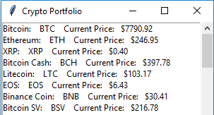
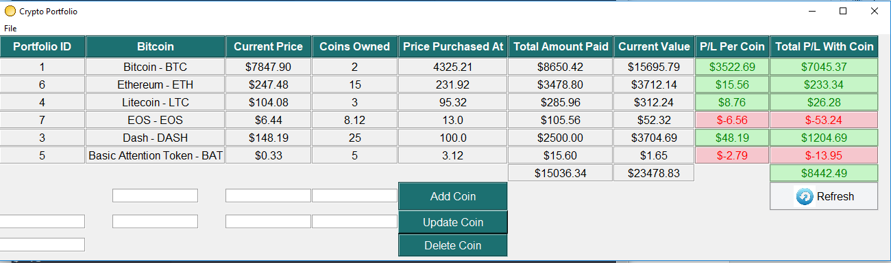
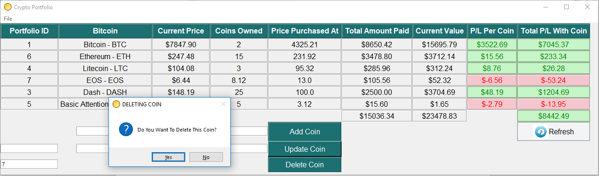

# PyCryptoPortfolio

This project is inspired by Udemy Course : **Building Portfolio App with Python Tkiner**. 
The purpose is to understand the basics of Python GUI, importing modules, extracting cyrpto currency data from the **CoinMarketCap API**, and baisc of database manegment with **SQLite3** 

## Below is a display of the app looks:
List of Currencies

Display of the desktop GUI:

Confirmation MessageBox for Delteing/Adding/Updating:

